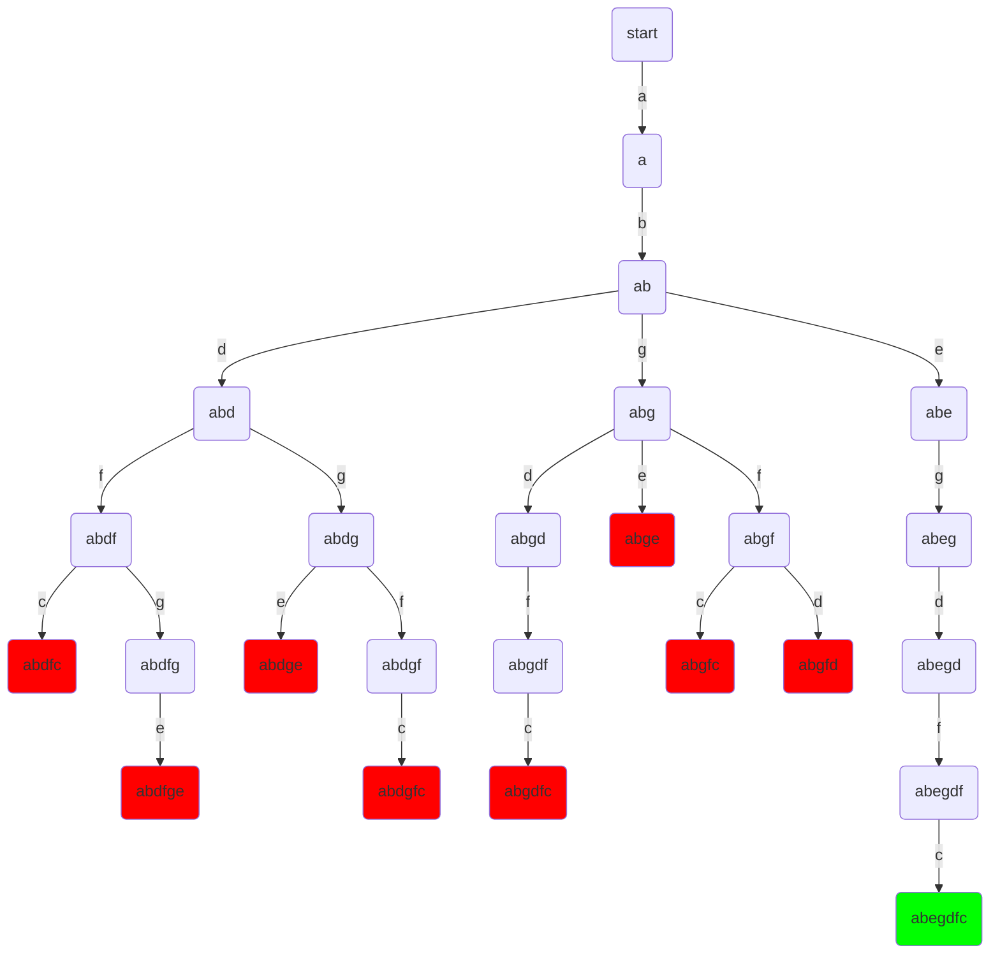

```mermaid
graph TD;
    root(start) --a--> 1(a)
    1 --b--> 2(ab)
    2 --d--> 3(abd)
    3 --f--> 4(abdf)
    4 --c--> 5(abdfc)
    style 5 fill:#ff0000
    
    4 --g--> 6(abdfg)
    6 --e--> 7(abdfge)
    style 7 fill:#ff0000

    3 --g--> 8(abdg)
    8 --e--> 9(abdge)
    style 9 fill:#ff0000

    8 --f--> 10(abdgf)
    10 --c--> 11(abdgfc)
    style 11 fill:#ff0000

    2 --g--> 12(abg)
    12 --d--> 13(abgd)
    13 --f--> 14(abgdf)
    14 --c--> 15(abgdfc)
    style 15 fill:#ff0000

    12 --e--> 16(abge)
    style 16 fill:#ff0000

    12 --f--> 17(abgf)
    17 --c--> 18(abgfc)
    style 18 fill:#ff0000

    17 --d--> 19(abgfd)
    style 19 fill:#ff0000

    2 --e--> 20(abe)
    20 --g--> 21(abeg)
    21 --d--> 22(abegd)
    22 --f--> 23(abegdf)
    23 --c--> 24(abegdfc)
    style 24 fill:#00ff00
```