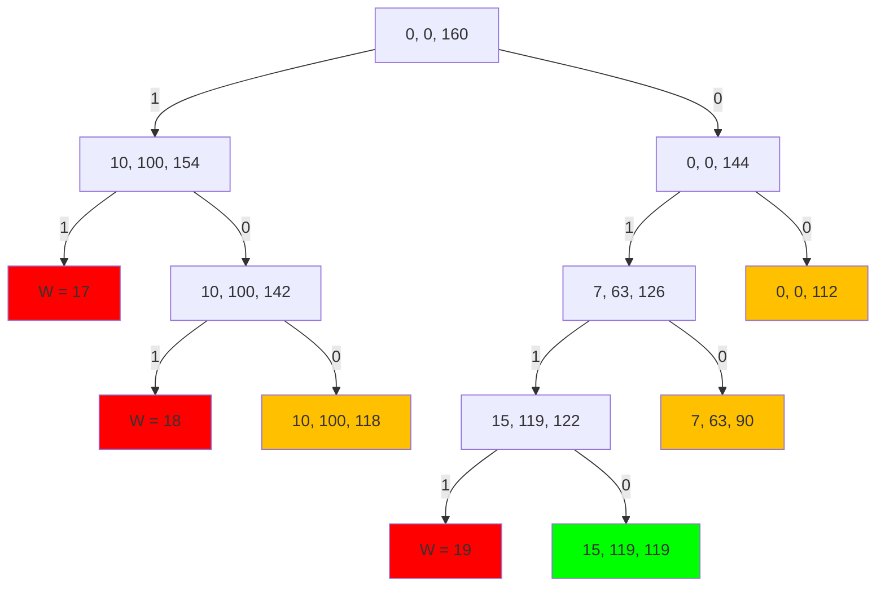

```mermaid
graph TD;
    1[0, 0, 160] --1--> 2[10, 100, 154]
    1 --0--> 3[0, 0, 144]
    2 --1--> 4[W = 17]
    style 4 fill:#ff0000

    2 --0--> 5[10, 100, 142]
    3 --1--> 6[7, 63, 126]
    3 --0--> 7[0, 0, 112]
    5 --1--> 8[W = 18]
    style 8 fill:#ff0000

    5 --0--> 9[10, 100, 118]
    6 --1--> 10[15, 119, 122]
    6 --0--> 11[7, 63, 90]
    10 --1--> 12[W = 19]
    style 12 fill:#ff0000

    10 --0--> 13[15, 119, 119]
    style 13 fill:#00ff00
    style 9 fill:#ffc000
    style 11 fill:#ffc000
    style 7 fill:#ffc000
```