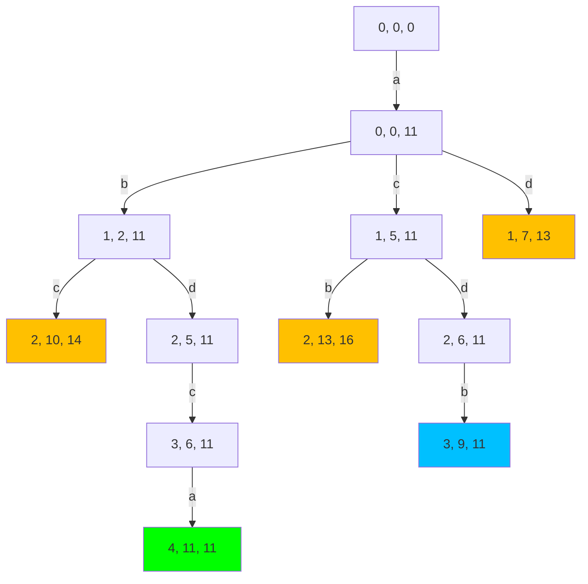

```mermaid
graph TD;
    root[0, 0, 0] --a--> 1[0, 0, 11]
    1 --b--> 2[1, 2, 11]
    1 --c--> 3[1, 5, 11]
    1 --d--> 4[1, 7, 13]
    2 --c--> 5[2, 10, 14]
    2 --d--> 6[2, 5, 11]
    3 --b--> 7[2, 13, 16]
    3 --d--> 8[2, 6, 11]
    6 --c--> 9[3, 6, 11]
    8 --b--> 10[3, 9, 11]
    9 --a--> 11[4, 11, 11]
    style 11 fill:#00ff00
    style 5 fill:#ffc000
    style 7 fill:#ffc000
    style 4 fill:#ffc000
    style 10 fill:#00c0ff
```