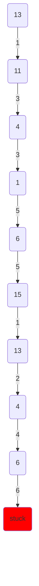

```mermaid
graph TD;
    1(13) --1--> 2(11)
    2 --3--> 3(4)
    3 --3--> 4(1)
    4 --5--> 5(6)
    5 --5--> 6(15)
    6 --1--> 7(13)
    7 --2--> 8(4)
    8 --4--> 9(6)
    9 --6--> 10(stuck)
    style 10 fill:#ff0000
```