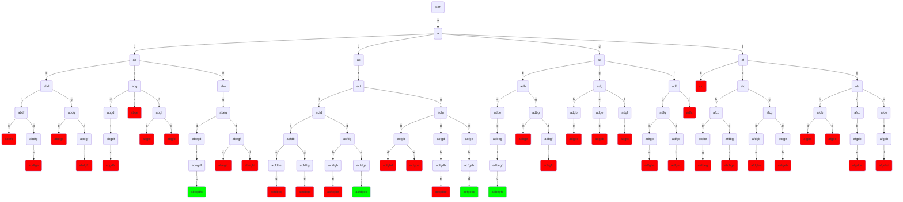

```mermaid
graph TD;
    root(start) --a--> 1(a)
    1 --b--> 2(ab)
    1 --c--> 3(ac)
    1 --d--> 4(ad)
    1 --f--> 5(af)
    2 --d--> 6(abd)
    2 --g--> 7(abg)
    2 --e--> 8(abe)
    3 --f--> 9(acf)
    4 --b--> 10(adb)
    4 --g--> 11(adg)
    4 --f--> 12(adf)
    5 --c--> 13(afc)
    style 13 fill:#ff0000
    5 --d--> 14(afc)
    5 --g--> 15(afc)
    6 --f--> 16(abdf)
    6 --g--> 17(abdg)
    7 --d--> 18(abgd)
    7 --e--> 19(abge)
    style 19 fill:#ff0000
    7 --f--> 20(abgf)
    8 --g--> 21(abeg)
    9 --d--> 22(acfd)
    9 --g--> 23(acfg)
    10 --e--> 24(adbe)
    10 --g--> 25(adbg)
    11 --b--> 26(adgb)
    11 --e--> 27(adge)
    11 --f--> 28(adgf)
    12 --g--> 29(adfg)
    12 --c--> 30(adfc)
    style 30 fill:#ff0000
    14 --b--> 31(afcb)
    14 --g--> 32(afcg)
    15 --b--> 33(afcb)
    15 --d--> 34(afcd)
    15 --e--> 35(afce)
    16 --c--> 36(abdfc)
    style 36 fill:#ff0000
    16 --g--> 37(abdfg)
    17 --e--> 38(abdge)
    style 38 fill:#ff0000
    17 --f--> 39(abdgf)
    18 --f--> 40(abgdf)
    20 --c--> 41(abgfc)
    style 41 fill:#ff0000
    20 --d--> 42(abgfd)
    style 42 fill:#ff0000
    21 --d--> 43(abegd)
    21 --f--> 44(abegf)
    22 --b--> 45(acfdb)
    22 --g--> 46(acfdg)
    23 --b--> 47(acfgb)
    23 --d--> 48(acfgd)
    23 --e--> 49(acfge)
    24 --g--> 50(adbeg)
    25 --e--> 51(adbge)
    style 51 fill:#ff0000
    25 --f--> 52(adbgf)
    26 --e--> 53(adgbe)
    style 53 fill:#ff0000
    27 --b--> 54(adgeb)
    style 54 fill:#ff0000
    28 --c--> 55(adgfc)
    style 55 fill:#ff0000
    29 --b--> 56(adfgb)
    29 --e--> 57(adfge)
    31 --e--> 58(afdbe)
    31 --g--> 59(afdbg)
    32 --b--> 60(afdgb)
    32 --e--> 61(afdge)
    33 --d--> 62(afgbd)
    style 62 fill:#ff0000
    33 --e--> 63(afgbe)
    style 63 fill:#ff0000
    34 --b--> 64(afgdb)
    35 --b--> 65(afgeb)
    37 --e--> 66(abdfge)
    style 66 fill:#ff0000
    39 --c--> 67(abdgfc)
    style 67 fill:#ff0000
    40 --c--> 68(abgdfc)
    style 68 fill:#ff0000
    43 --f--> 69(abegdf)
    44 --c--> 70(abegfc)
    style 70 fill:#ff0000
    44 --d--> 71(abegfd)
    style 71 fill:#ff0000
    45 --e--> 72(acfdbe)
    45 --g--> 73(acfdbg)
    46 --b--> 74(acfdgb)
    46 --e--> 75(acfdge)
    47 --d--> 76(acfgbd)
    style 76 fill:#ff0000
    47 --e--> 77(acfgbe)
    style 77 fill:#ff0000
    48 --b--> 78(acfgdb)
    49 --b--> 79(acfgeb)
    50 --f--> 80(adbegf)
    52 --c--> 81(adbgfc)
    style 81 fill:#ff0000
    56 --e--> 82(adfgbe)
    style 82 fill:#ff0000
    57 --b--> 83(adfgeb)
    style 83 fill:#ff0000
    58 --g--> 84(afdbeg)
    style 84 fill:#ff0000
    59 --e--> 85(afdbge)
    style 85 fill:#ff0000
    60 --e--> 86(afdgbe)
    style 86 fill:#ff0000
    61 --b--> 87(afdgeb)
    style 87 fill:#ff0000
    64 --e--> 88(afgdbe)
    style 88 fill:#ff0000
    65 --d--> 89(afgebd)
    style 89 fill:#ff0000
    69 --c--> 90(abegdfc)
    style 90 fill:#00ff00
    72 --g--> 91(acfdbeg)
    style 91 fill:#ff0000
    73 --e--> 92(acfdbge)
    style 92 fill:#ff0000
    74 --e--> 93(acfdgbe)
    style 93 fill:#ff0000
    75 --b--> 94(acfdgeb)
    style 94 fill:#00ff00
    78 --e--> 95(acfgdbe)
    style 95 fill:#ff0000
    79 --d--> 96(acfgebd)
    style 96 fill:#00ff00
    80 --c--> 97(adbegfc)
    style 97 fill:#00ff00
```