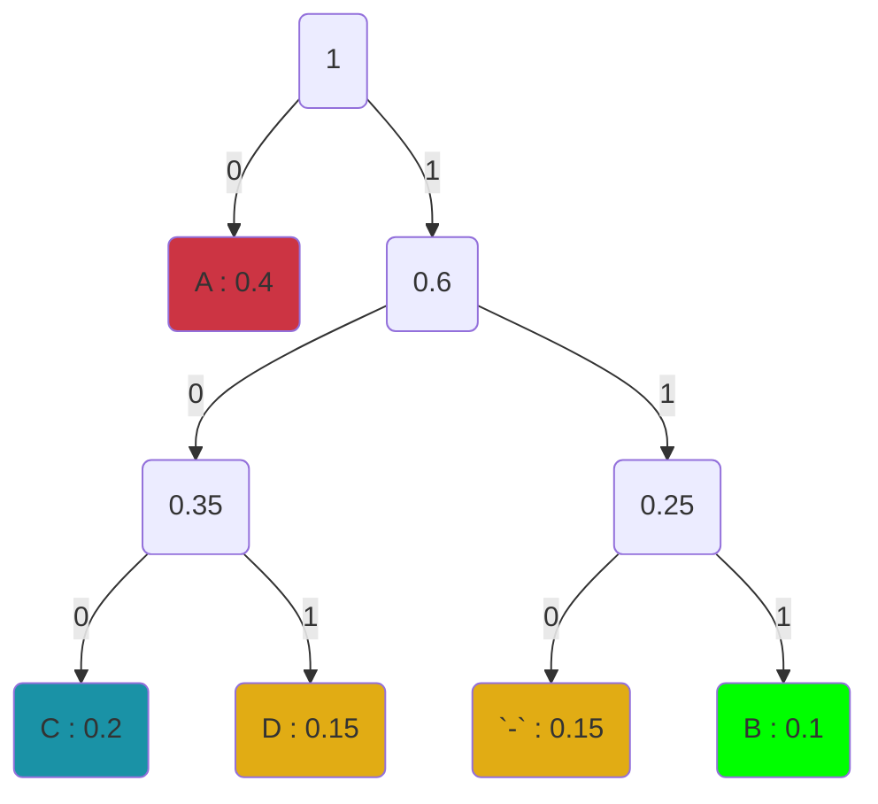

```mermaid
graph TD;
    1(A : 0.4)
    style 1 fill:#cc3443
    2(C : 0.2)
    style 2 fill:#1a92a6
    3(D : 0.15)
    style 3 fill:#e1ac14
    4(`-` : 0.15)
    style 4 fill:#e1ac14
    5(B : 0.1)
    style 5 fill:#00ff00
    6(0.25) --0--> 4
    6 --1--> 5
    7(0.35) --0--> 2
    7 --1--> 3
    8(0.6) --0--> 7
    8 --1--> 6
    9(1) --0--> 1
    9 --1--> 8
```